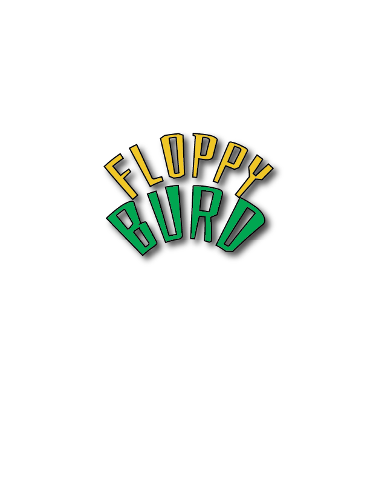

  

# 🎮 Floppy Burd

🐦 **Floppy Burd** is a remake of the classic Flappy Bird, developed in **Unity** using **C#**, with enhanced gameplay, dynamic progression, different GUI and a challenging experience!

---

## 🕹️ Features

- 🚀 **Dynamic Speed**: pipes move faster as the score increases.
- ⏱️ **Adaptive Spawn Rate**: new obstacles spawn faster for more intense gameplay.
- 💥 **Game Over Screen** on collision with quick restart option.
- 📈 **Scoring System**: each successful pass adds points.
- 🔊 **Sound effects** and visual feedback for an immersive experience.

---

## 🧠 Technologies Used

- 🧱 **Unity** – game engine.
- 💻 **C#** – main scripting language.
- 🎨 **2D Sprites** – for backgrounds, characters, and obstacles.

---

## 🏁 How to Run the Game 

You can download and play **Floppy Burd** by following these steps:

### 🔹 Option 1: Portable `.exe` (no install)
1. Go to the [`Releases`](https://github.com/hehealexandru/Floppy_Burd/releases) section.
2. Download the latest version:  
   👉 [`FloppyBurd_v1.0.zip`](https://github.com/hehealexandru/Floppy_Burd/releases/download/v1.0/FloppyBurd_v1.0.zip)
3. Extract the `.zip` archive.
4. Run `FloppyBurd.exe` and enjoy 🐦

### 🔹 Option 2: Installer `.exe`
1. Download the installer:  
   👉 [`FloppyBurdSetup.exe`](https://github.com/hehealexandru/Floppy_Burd/releases/download/v1.0/FloppyBurdSetup.exe)
2. Run the installer and follow the steps.
3. Launch from Desktop shortcut or Start Menu.

**Note:** If Windows blocks the file, click "More info" → "Run anyway".

---

## 👨‍💻 Author

Created by **@hehealexandru**  
📍 Educational & entertainment project.

---

## ☁️ Coming Soon

- 🏆 **High Score** to see your best scores
- 🎨 **Character Skins** for Burd with special abilities
- 🌄 **Background Skins** changing based on progress
- 🎶 **Interactive Music** that adapts to gameplay
